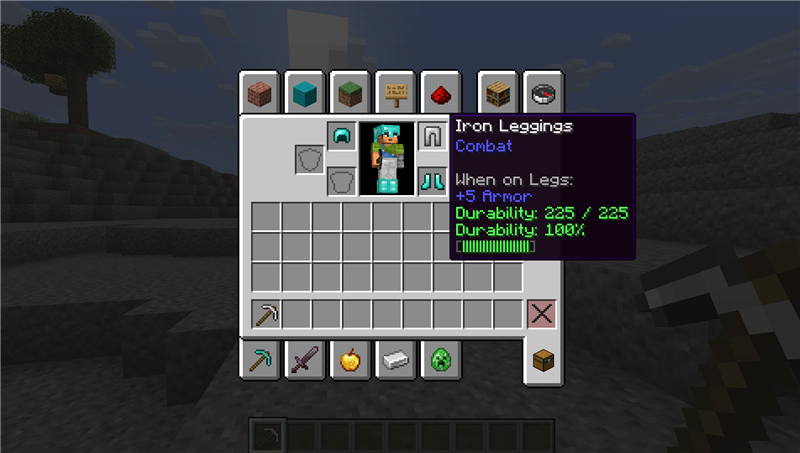

# DurabilityInfo

**Track your item durability everywhere — tooltip, HUD, and configurable warnings.**

## Features

### 🛡️ Item Tooltip
Shows durability info directly on every damageable item's tooltip:
- **Numbers** — `Durability: 235 / 500`
- **Percentage** — `Durability: 47%`
- **Color-coded bar** — green → yellow → red as durability drops

### 🖥️ HUD Overlay
Always-visible durability display on screen:
- Shows **item icons** with a colored durability bar (or percentage) under each
- Displays: helmet, chestplate, leggings, boots, main hand, offhand
- Semi-transparent background for readability
- Configurable position (top-left/right, bottom-left/right) + X/Y offset

### ⚠️ Low Durability Warning
- Configurable threshold (`warningThreshold`, default: 10%)
- Below threshold: **red flashing bar** + **ITEM_BREAK sound** (2s cooldown)
- Helps prevent tools and armor from breaking unexpectedly

## Configuration

File: `.minecraft/config/durabilityinfo.json`

| Option | Default | Description |
|--------|---------|-------------|
| `showDurabilityNumbers` | `true` | Show current / max durability in tooltip |
| `showPercentage` | `true` | Show durability percentage in tooltip |
| `showBar` | `true` | Show color-coded durability bar in tooltip |
| `showOnUnbreakable` | `false` | Show info on unbreakable items |
| `warningThreshold` | `10` | Low durability warning threshold (%) |
| `hudAnchor` | `BOTTOM_RIGHT` | HUD position (`TOP_LEFT`, `TOP_RIGHT`, `BOTTOM_LEFT`, `BOTTOM_RIGHT`) |
| `hudOffsetX` | `4` | HUD horizontal offset (px) |
| `hudOffsetY` | `4` | HUD vertical offset (px) |
| `hudDisplayMode` | `BAR` | HUD display: `BAR` (icon + bar) or `PERCENTAGE` (icon + % text) |
| `showDamageDealt` | `false` | Show damage taken instead of remaining durability |

If [Cloth Config](https://modrinth.com/mod/cloth-config) and [Mod Menu](https://modrinth.com/mod/modmenu) are installed, you can configure everything in-game from the Mods screen.

## Requirements

- Minecraft 26.1.x
- [Fabric Loader](https://fabricmc.net/) ≥ 0.18.5
- [Fabric API](https://modrinth.com/mod/fabric-api)

## Optional

- [Cloth Config](https://modrinth.com/mod/cloth-config) — in-game config screen
- [Mod Menu](https://modrinth.com/mod/modmenu) — access config from the Mods list

## License

MIT — see [LICENSE](LICENSE)
